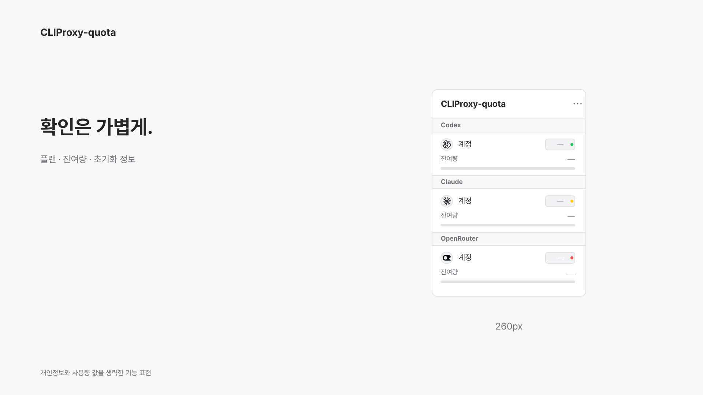
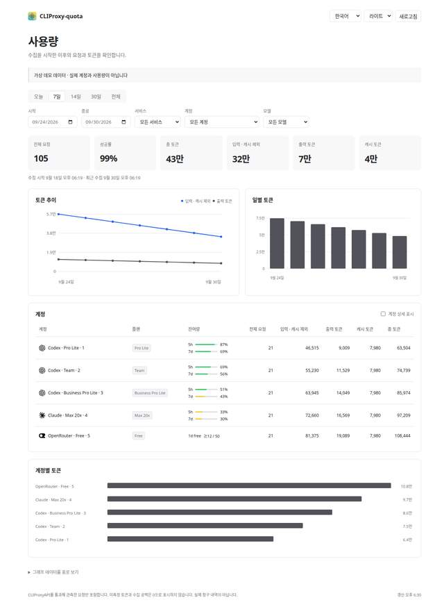
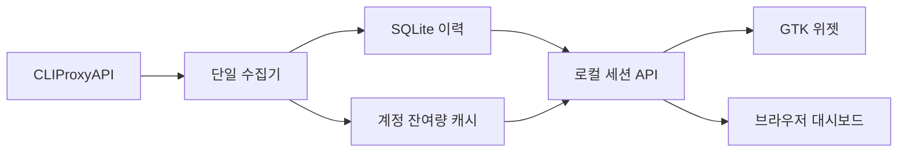

# CLIProxy-quota

한국어 · [English](README.md)

[CLIProxyAPI](https://github.com/router-for-me/CLIProxyAPI)를 사용하는 Linux 사용자를 위한 작은 GTK 사용량 위젯, 공식 관리 화면의 미니멀 테마, 로컬 토큰 이력을 제공합니다.

## 만든 이유

폭 260px 창에서 플랜·잔여량·초기화 날짜를 확인하고, 필요할 때 계정 아이콘을 눌러 상세 정보를 봅니다. 이미 실행 중인 프록시에 연결하며 프록시 서버를 설치하거나 실행하지 않습니다.

| 프로젝트 | 중심 기능 |
| --- | --- |
| [CLIProxy Quota Tray](https://github.com/ZYHUO/CLIProxy-Quota-Tray) | Electron 트레이와 대시보드 |
| CLIProxy-quota | 작은 Linux 네이티브 GTK 위젯과 별도 로컬 토큰 대시보드 |

CLIProxyAPI 공식 클라이언트가 아닌 독립 프로젝트입니다.

## 화면

[](docs/video/cliproxy-quota-ko.mp4)

[한국어 영상](docs/video/cliproxy-quota-ko.mp4) · [English video](docs/video/cliproxy-quota-en.mp4). 코드를 렌더해 만든 기능 소개 영상이며 사용량 수치는 생략했습니다. 실제 계정을 녹화한 영상이 아닙니다. [제작 근거와 재현](docs/video/SOURCES.md).


| 라이트 | 다크 |
| --- | --- |
|  |  |



스크린샷은 가상 계정·사용량으로 만들었습니다. 실제 계정 정보가 아닙니다.

## 빠른 시작

Python 3.10 이상, GTK 3, PyGObject, Cairo, Ayatana AppIndicator가 필요합니다. Ubuntu 24.04 기준:

```bash
sudo apt install git python3-gi python3-gi-cairo gir1.2-gtk-3.0 gir1.2-ayatanaappindicator3-0.1 librsvg2-common fonts-noto-cjk
git clone https://github.com/Changroro/CLIProxy-quota.git
cd CLIProxy-quota
```

`~/.config/cli-proxy-quota/config.json`을 만들고 **CLIProxyAPI 관리 키**를 입력합니다.

```json
{
  "base_url": "http://127.0.0.1:8317",
  "management_key": "YOUR_MANAGEMENT_KEY",
  "theme": "system",
  "language": "system"
}
```

```bash
chmod 600 ~/.config/cli-proxy-quota/config.json
./bin/cli-proxy-quota-window
```

기본 관리 화면은 공식 Management Center에 미니멀 테마를 적용해 사용합니다. [테마 빌드·설치 안내](docs/MANAGEMENT_THEME.md)를 참고하세요. 위젯의 대시보드 아이콘과 `./bin/cli-proxy-quota open`은 공식 화면을 엽니다.

토큰 이력 수집기는 다른 터미널에서 실행합니다.

```bash
./bin/cli-proxy-quota dashboard
```

토큰 이력 화면은 `http://127.0.0.1:8318`에서 제공됩니다. `./bin/cli-proxy-quota open-history`로 열면 로컬 세션이 연결됩니다. 기록이 꺼져 있으면 이력 화면의 **사용량 기록 켜기**를 누릅니다. 프록시의 기록 설정을 바꾸고 새 요청부터 수집합니다. 같은 상태 폴더에는 수집기를 하나만 실행할 수 있습니다.

이미 실행 중인 토큰 이력 화면은 `./bin/cli-proxy-quota open-history`로 엽니다. `--no-open`은 브라우저를 띄우지 않고 서버만 실행합니다. 이력을 유지하려면 서버를 실행해두세요. Ctrl+C로 종료합니다. 로컬 대시보드를 설정하지 않았을 때 위젯은 단독으로 동작합니다.

`--background`를 붙이면 창을 숨긴 채 트레이에서 시작합니다. 같은 명령을 다시 실행하면 창이 열립니다. GNOME 상단바 아이콘에는 AppIndicator 지원이 필요하며 위젯 창은 별도로 동작합니다.

## 기능

**위젯**


- Codex 5h·7d 잔여량, API 플랜 배지, 사용 가능한 Reset 만기일.
- Claude 5h·7d 잔여량과 OAuth 프로필 기반 Pro·Max 플랜. API가 제공하면 Max 5x·20x 표시.
- OpenRouter 무료 티어와 관측한 일별 요청 수. 관측값은 전체 청구 내역이 아닙니다.
- 서비스 아이콘을 눌러 메일·별칭·기간별 다음/직전 초기화 확인.
- 계정별 접기, 항상 위 고정, 창 끌기.
- Codex 계정 우선순위 편집·저장·취소. 저장에는 `routing.strategy: fill-first` 필요.
- 프록시 쿨다운 리셋. 서비스 구독의 사용량 한도를 초기화하는 기능은 아닙니다.
- 시스템·라이트·다크 테마, 선명한 잔여량 색, 영어·한국어.

**공식 관리 화면과 토큰 이력**

공식 관리 화면의 계정·OAuth·쿼터·설정·로그 기능을 유지하고 라이트·다크 미니멀 테마를 적용합니다. 공식 화면의 언어는 원본 지원 범위를 유지하며 한국어 번역은 별도입니다. 공식 사이드바의 **Usage** 탭에서 기존 관리 로그인으로 아래 토큰 이력 기능을 사용할 수 있습니다. 브라우저 PC에서 로컬 수집기가 실행 중이어야 합니다. [연결 방식·외부 요청 수집 범위·공식 이슈 조사](docs/USAGE_INTEGRATION.md)를 참고하세요.

- 오늘·7/14/30일·전체·사용자 지정 기간, 서비스·계정·모델 필터.
- 기록된 요청 실행 수·성공률·총/입력/출력/캐시 토큰과 계정별 집계.
- 토큰 추이 선그래프, 일별·계정별 막대그래프, 키보드로 열 수 있는 데이터 표.
- 한국어·영어, 시스템·라이트·다크, 모바일 화면.
- 수집 시작·최근 수집 시각, 수집 중단과 토큰 미측정 상태 표시.

**집계와 개인정보**

- 입력은 캐시를 제외하고, 출력은 추론 토큰을 포함합니다. 총 토큰 = 일반 입력 + 캐시 읽기/쓰기 + 출력입니다.
- 실행 ID로 중복 저장을 막습니다. 재시도는 별도 실행 기록일 수 있습니다.
- 미측정 값은 미상으로 유지하며 가격이나 과거 사용량을 추정하지 않습니다.
- 자체 토큰 이력 화면은 관리 키를 서버에만 보관하며 브라우저는 로컬 세션으로 접근합니다. 공식 관리 화면은 기존 방식대로 관리 키로 로그인합니다. SQLite에는 집계 필드만 저장하고 API 키·OAuth 토큰·요청 본문은 저장하지 않습니다.

## 설정

| 항목 | 값 / 동작 |
| --- | --- |
| `base_url` | 관리 API 경로 없는 서버 호스트·포트 |
| `management_key` | CLIProxyAPI 관리 키. 소스·스크린샷에 넣지 않습니다 |
| `theme` | `system`, `light`, `dark`. `⋯ → 테마`에서 변경 |
| `language` | `system`, `en`, `ko`. `⋯ → 언어`에서 변경하면 위젯 재시작 |
| `dashboard_url` | 공용 수집기·토큰 이력 주소. 공식 화면 버튼과 별개 |

`CLIPROXY_BASE_URL`, `CLIPROXY_MANAGEMENT_KEY`, `CLIPROXY_LANGUAGE` 환경 변수로 해당 설정을 덮어쓸 수 있습니다. 한국어 외 시스템 언어는 영어를 사용합니다. 이력·별칭은 XDG state/config 폴더에 저장합니다. 계정 잔여량은 공용 수집기가 120초마다 조회합니다. Claude 429 응답은 대기 시간을 지키고 캐시값임을 알립니다. 사용량 이벤트는 5초마다 수집하며 연결 오류가 나면 재시도 간격을 최대 30초까지 늘립니다. 대시보드 화면은 10초마다 로컬 기록을 갱신합니다.

현재 관리 API 경로는 CLIProxyAPI v8 기준입니다. 이전 버전에는 해당 경로가 없을 수 있습니다. 플랜 배지는 내부 코드를 읽기 편하게 표시하며 가격을 추정하지 않습니다. API가 값을 주지 않으면 미제공 상태를 표시합니다.

## 개발과 대시보드 진행 상황

별도 worktree에서 개발합니다. [uv](https://docs.astral.sh/uv/)와 위 시스템 패키지를 준비하고 실행합니다.

```bash
uv run --no-project --python /usr/bin/python3 python -m unittest discover -s tests -v
GDK_SCALE=2 xvfb-run -a -s '-screen 0 1600x2200x24' uv run --no-project --python /usr/bin/python3 python scripts/render_previews.py --language ko --output /tmp/quota-previews
```

위젯과 대시보드를 구현하고 검증했습니다. 대시보드가 프록시 사용량 큐를 읽고 `~/.local/state/cli-proxy-quota/usage.sqlite3`에 집계 데이터를 보존합니다. 위젯과 브라우저는 같은 잔여량 캐시를 읽습니다. 프록시 큐는 읽을 때 기록을 제거하며 보관 시간이 제한돼 있어, 수집 중단 시 누락될 수 있습니다. 다른 소비자·구독자를 같은 큐에 연결하지 마세요. 과거 이력은 소급해서 채우지 않습니다.



대시보드는 루프백 주소에만 바인딩하며 다른 Origin·Host의 요청을 거부합니다. 종료·재시작해도 SQLite 이력은 유지됩니다. 관리 API 경로는 CLIProxyAPI v8 기준입니다.

자동화에서는 같은 저장 코어를 JSON으로 조회할 수 있습니다.

```bash
./bin/cli-proxy-quota usage --start 1790722800 --end 1790809200 --timezone Asia/Seoul
```

데이터 계약·디자인 기준은 [docs/DASHBOARD.md](docs/DASHBOARD.md), 후속 작업은 [TODO.md](TODO.md)를 참고하세요. 영상 재현에는 Node.js·Chrome·ffmpeg가 필요하지만 앱 실행에는 필요하지 않습니다.

## 라이선스

프로젝트 코드: [MIT](LICENSE). 브랜드 에셋의 권리는 각 소유자에게 있으며 출처·고지는 [assets/README.md](assets/README.md)에 있습니다. 상단바 아이콘은 CLIProxyAPI가 추천하는 EasyCLIProxyAPI 데스크톱 앱의 에셋을 사용합니다. 공식 인증이나 제휴를 의미하지 않습니다.
