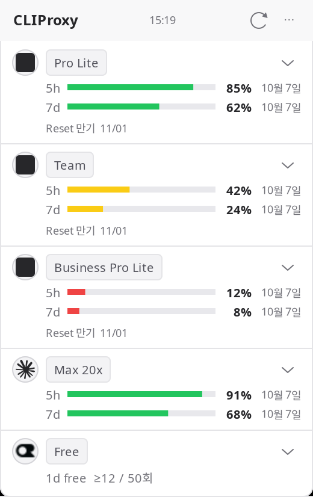
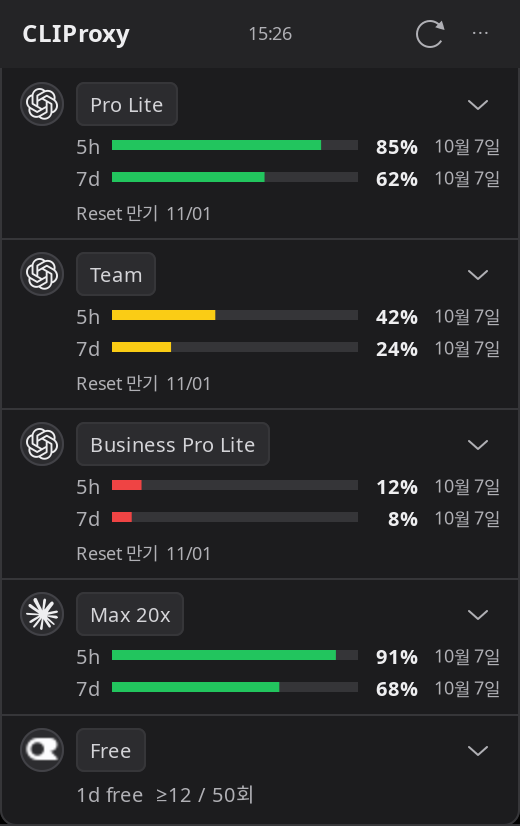

# CLIProxy-quota

한국어 · [English](README.md)

[CLIProxyAPI](https://github.com/router-for-me/CLIProxyAPI)를 사용하는 Linux 사용자를 위한 작은 GTK 사용량 위젯입니다.

## 만든 이유

폭 260px 창에서 플랜·잔여량·초기화 날짜를 확인하고, 필요할 때 계정 아이콘을 눌러 상세 정보를 봅니다. 이미 실행 중인 프록시에 연결하며 프록시 서버를 설치하거나 실행하지 않습니다.

| 프로젝트 | 중심 기능 |
| --- | --- |
| [CLIProxy Quota Tray](https://github.com/ZYHUO/CLIProxy-Quota-Tray) | Electron 트레이와 대시보드 |
| CLIProxy-quota | 작은 Linux 네이티브 GTK 위젯. 별도 대시보드는 개발 예정 |

CLIProxyAPI 공식 클라이언트가 아닌 독립 프로젝트입니다.

## 화면

| 라이트 | 다크 |
| --- | --- |
|  |  |

스크린샷은 가상 계정·사용량으로 만들었습니다. 실제 계정 정보가 아닙니다.

## 빠른 시작

Python 3.10 이상, GTK 3, PyGObject, Cairo, Ayatana AppIndicator가 필요합니다. Ubuntu 24.04 기준:

```bash
sudo apt install git python3-gi python3-gi-cairo gir1.2-gtk-3.0 gir1.2-ayatanaappindicator3-0.1 librsvg2-common fonts-noto-cjk
git clone https://github.com/Changroro/CLIProxy-quota.git
cd CLIProxy-quota
```

`~/.config/cli-proxy-quota/config.json`을 만들고 **CLIProxyAPI 관리 키**를 입력합니다.

```json
{
  "base_url": "http://127.0.0.1:8317",
  "management_key": "YOUR_MANAGEMENT_KEY",
  "theme": "system",
  "language": "system"
}
```

```bash
chmod 600 ~/.config/cli-proxy-quota/config.json
./bin/cli-proxy-quota-window
```

`--background`를 붙이면 창을 숨긴 채 트레이에서 시작합니다. 같은 명령을 다시 실행하면 창이 열립니다. GNOME 상단바 아이콘에는 AppIndicator 지원이 필요하며 위젯 창은 별도로 동작합니다.

## 기능

- Codex 5h·7d 잔여량, API 플랜 배지, 사용 가능한 Reset 만기일.
- Claude 5h·7d 잔여량과 OAuth 프로필 기반 Pro·Max 플랜. API가 제공하면 Max 5x·20x 표시.
- OpenRouter 무료 티어와 관측한 일별 요청 수. 관측값은 전체 청구 내역이 아닙니다.
- 서비스 아이콘을 눌러 메일·별칭·기간별 다음/직전 초기화 확인.
- 계정별 접기, 항상 위 고정, 창 끌기.
- Codex 계정 우선순위 편집·저장·취소. 저장에는 `routing.strategy: fill-first` 필요.
- 프록시 쿨다운 리셋. 서비스 구독의 사용량 한도를 초기화하는 기능은 아닙니다.
- 시스템·라이트·다크 테마, 선명한 잔여량 색, 영어·한국어.

## 설정

| 항목 | 값 / 동작 |
| --- | --- |
| `base_url` | 관리 API 경로 없는 서버 호스트·포트 |
| `management_key` | CLIProxyAPI 관리 키. 소스·스크린샷에 넣지 않습니다 |
| `theme` | `system`, `light`, `dark`. `⋯ → 테마`에서 변경 |
| `language` | `system`, `en`, `ko`. `⋯ → 언어`에서 변경하면 위젯 재시작 |
| `dashboard_url` | 기존 대시보드 주소. 설정 전에는 버튼 숨김 |

`CLIPROXY_BASE_URL`, `CLIPROXY_MANAGEMENT_KEY`, `CLIPROXY_LANGUAGE` 환경 변수로 해당 설정을 덮어쓸 수 있습니다. 한국어 외 시스템 언어는 영어를 사용합니다. 이력·별칭은 XDG state/config 폴더에 저장합니다. 조회 주기는 120초이며 Claude 429 응답은 대기 시간을 지키고 캐시값임을 알립니다.

현재 관리 API 경로는 CLIProxyAPI v8 기준입니다. 이전 버전에는 해당 경로가 없을 수 있습니다. 플랜 배지는 내부 코드를 읽기 편하게 표시하며 가격을 추정하지 않습니다. API가 값을 주지 않으면 미제공 상태를 표시합니다.

## 개발과 대시보드 진행 상황

별도 worktree에서 개발합니다. [uv](https://docs.astral.sh/uv/)와 위 시스템 패키지를 준비하고 실행합니다.

```bash
uv run --no-project --python /usr/bin/python3 python -m unittest discover -s tests -v
GDK_SCALE=2 xvfb-run -a -s '-screen 0 1600x2200x24' uv run --no-project --python /usr/bin/python3 python scripts/render_previews.py --language ko --output /tmp/quota-previews
```

위젯은 구현했습니다. 대시보드는 **아직 미구현**입니다. SQLite 실행 중복 방지·토큰 정규화·기간/계정별 집계는 테스트했으며 수집기·로컬 API·시계열·브라우저 화면이 남았습니다. [TODO.md](TODO.md)를 참고하세요. 위젯 실행은 운영 사용량 큐를 켜거나 소비하지 않습니다. 기록을 제거하는 큐에는 수집기를 여러 개 연결하면 안 됩니다.

## 라이선스

프로젝트 코드: [MIT](LICENSE). 브랜드 에셋의 권리는 각 소유자에게 있으며 출처·고지는 [assets/README.md](assets/README.md)에 있습니다. 상단바 아이콘은 CLIProxyAPI가 추천하는 EasyCLIProxyAPI 데스크톱 앱의 에셋을 사용합니다. 공식 인증이나 제휴를 의미하지 않습니다.
