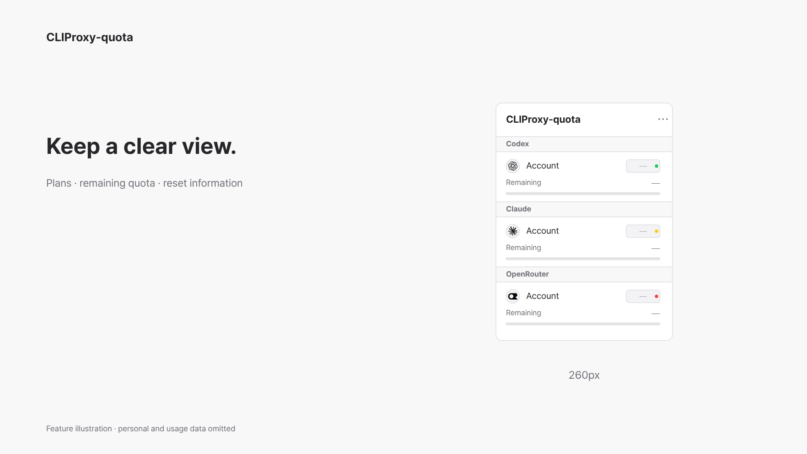
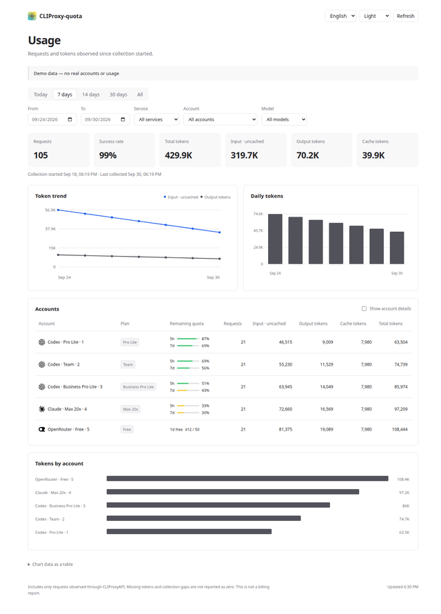
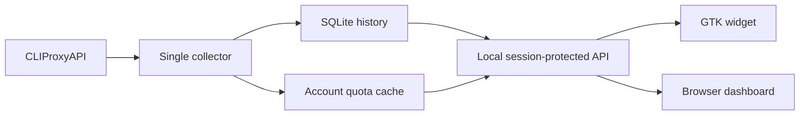

# CLIProxy-quota

[한국어](README.ko.md) · English

A compact GTK quota widget, minimal theme for the official management screen, and local token history for Linux users of [CLIProxyAPI](https://github.com/router-for-me/CLIProxyAPI).

## Why

Keep account plans, remaining quota and reset dates visible in a 260px window. Open account details when you need them. This project connects to an existing proxy; it does not install or run the proxy itself.

| Project | Focus |
| --- | --- |
| [CLIProxy Quota Tray](https://github.com/ZYHUO/CLIProxy-Quota-Tray) | Electron tray and dashboard |
| CLIProxy-quota | Native GTK widget, official management theme and persistent token history |

This is an independent project, not an official CLIProxyAPI client.

## Preview

[](docs/video/cliproxy-quota-en.mp4)

[English video](docs/video/cliproxy-quota-en.mp4) · [한국어 영상](docs/video/cliproxy-quota-ko.mp4). The code-rendered introduction omits usage values; it is not a recording of private accounts. [Sources and reproduction](docs/video/SOURCES.md).


| Light | Dark |
| --- | --- |
|  |  |



Screenshots use synthetic demo accounts and usage, not private account data.

## Quick start

Requires Python 3.10+, GTK 3, PyGObject, Cairo and Ayatana AppIndicator. On Ubuntu 24.04:

```bash
sudo apt install git python3-gi python3-gi-cairo gir1.2-gtk-3.0 gir1.2-ayatanaappindicator3-0.1 librsvg2-common fonts-noto-cjk
git clone https://github.com/Changroro/CLIProxy-quota.git
cd CLIProxy-quota
```

Create `~/.config/cli-proxy-quota/config.json`, replace the placeholder with your CLIProxyAPI **management key**, and protect the file:

```json
{
  "base_url": "http://127.0.0.1:8317",
  "management_key": "YOUR_MANAGEMENT_KEY",
  "theme": "system",
  "language": "system"
}
```

```bash
chmod 600 ~/.config/cli-proxy-quota/config.json
./bin/cli-proxy-quota-window
```

The default management screen is the official Management Center with our minimal theme. See [build and installation](docs/MANAGEMENT_THEME.md). The widget dashboard icon and `./bin/cli-proxy-quota open` open the official screen.

To start the token-history collector, run this in another terminal:

```bash
./bin/cli-proxy-quota dashboard
```

The token-history screen is served at `http://127.0.0.1:8318`. Open it with `./bin/cli-proxy-quota open-history` to establish the local session. If recording is off, use **Enable recording** in the dashboard. This changes the proxy's usage recording setting and starts collecting new events. Only one collector can run for the state directory.

Use `./bin/cli-proxy-quota open-history` to reopen the running history screen. `--no-open` starts the server without opening a browser. Keep the server running to preserve history; Ctrl+C stops it. The widget works standalone when no local dashboard is configured.

Use `--background` to start with the window hidden. Run the command again to open it. GNOME needs AppIndicator support enabled to display the tray icon; the window works independently.

## Features

**Widget**


- Codex 5h/7d quota, API-reported plan badges and available Reset expiry dates.
- Claude 5h/7d quota and Pro/Max plan from the OAuth profile, including Max 5x/20x when reported.
- OpenRouter free-tier status and observed daily request counts. Observed counts are not a complete billing report.
- Account details and aliases behind the service icon; separate next/last reset information for each period.
- Per-account collapse, keep-on-top and window dragging.
- Codex priority editing with save/cancel. Saving requires CLIProxy `routing.strategy: fill-first`.
- Proxy cooldown reset. This clears proxy cooldown, not the provider subscription quota.
- System/light/dark themes, vivid quota colors, English and Korean.

**Official management and token history**

The minimal light/dark theme preserves official credentials, OAuth, quota, configuration and logs. Official language support is unchanged; Korean translation is separate. The official sidebar now includes a **Usage** tab that authenticates with the current management connection and embeds the retained history screen. The collector must run on the browser computer. See [integration, collection scope and upstream research](docs/USAGE_INTEGRATION.md). Additional features:

- Today, 7/14/30 days, all history and custom date ranges, filtered by service, account and model.
- Recorded executions, success rate and total/input/output/cache tokens, with per-account totals.
- Token trend, daily bars and account comparison bars; keyboard-accessible chart data table.
- English/Korean, system/light/dark and mobile layouts.
- Collection start/last-seen times, interruptions and unmeasured tokens are visible.

**Accounting and privacy**

- Input excludes cache; output includes reasoning. Total = uncached input + cache read/write + output.
- Execution IDs prevent duplicate ingestion. Retries may create separate execution records.
- Missing measurements remain unknown. Prices and past usage are not invented.
- For the local history screen, management keys stay server-side and the browser uses a local session. The official management screen uses its existing management-key login. SQLite stores only accounting fields, not API keys, OAuth tokens or request bodies.

## Settings

| Setting | Values / behavior |
| --- | --- |
| `base_url` | Proxy host and port, without a management API path |
| `management_key` | Server-side management key; never included in screenshots or source |
| `theme` | `system`, `light`, `dark`; change through `⋯ → Theme` |
| `language` | `system`, `en`, `ko`; change through `⋯ → Language`; restarts the widget |
| `dashboard_url` | Shared collector/history URL; separate from the official management button |

`CLIPROXY_BASE_URL`, `CLIPROXY_MANAGEMENT_KEY` and `CLIPROXY_LANGUAGE` override their respective settings. Other system locales use English. State and aliases live in the XDG state/config directories. Account quota is refreshed every 120 seconds by the shared collector; Claude HTTP 429 respects the retry delay and labels cached data. Usage events are collected every 5 seconds; connection failures increase retries up to 30 seconds. The dashboard refreshes its local view every 10 seconds.

The current management API client targets CLIProxyAPI v8. Older versions may not expose these paths. Internal plan codes are shown as readable labels; prices are never inferred. If a provider does not supply a value, the widget reports that instead of inventing it.

## Development and dashboard status

Use a separate worktree for changes. Install [uv](https://docs.astral.sh/uv/) and the native packages above, then run:

```bash
uv run --no-project --python /usr/bin/python3 python -m unittest discover -s tests -v
GDK_SCALE=2 xvfb-run -a -s '-screen 0 1600x2200x24' uv run --no-project --python /usr/bin/python3 python scripts/render_previews.py --language en --output /tmp/quota-previews
```

The widget and dashboard are implemented and tested. The dashboard consumes the proxy's usage queue and persists accounting data to `~/.local/state/cli-proxy-quota/usage.sqlite3`. The widget and browser share the quota cache. The proxy queue is destructive and has a retention window; interruptions can lose data. Avoid other consumers/subscribers of that queue. Prior history is not backfilled.



The dashboard binds only to loopback and rejects foreign origins/hosts. Stop/start preserves the SQLite history. Supported management paths target CLIProxyAPI v8.

For automation, the same ledger queries are available as JSON:

```bash
./bin/cli-proxy-quota usage --start 1790722800 --end 1790809200 --timezone Asia/Seoul
```

See [docs/DASHBOARD.md](docs/DASHBOARD.md) for the data contract and design reference, and [TODO.md](TODO.md) for follow-up work. Video reproduction uses Node.js, Chrome and ffmpeg; these are not required to run the app.

## License

Project code: [MIT](LICENSE). Brand assets retain their owners' rights; sources and notices are in [assets/README.md](assets/README.md). The tray icon comes from the upstream-recommended EasyCLIProxyAPI desktop client and does not imply endorsement.
