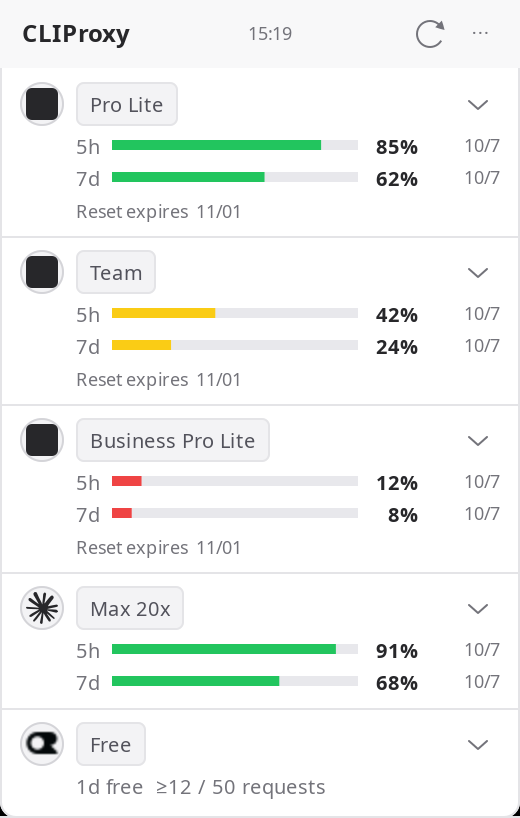
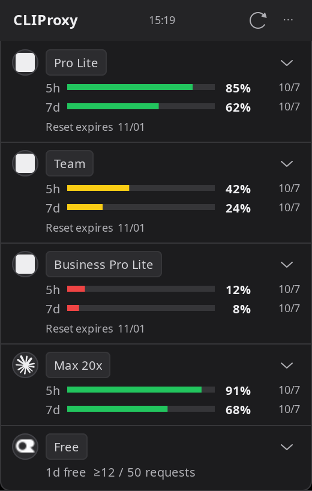

# CLIProxy-quota

[한국어](README.ko.md) · English

A compact GTK quota widget for Linux users of [CLIProxyAPI](https://github.com/router-for-me/CLIProxyAPI).

## Why

Keep account plans, remaining quota and reset dates visible in a 260px window. Open account details when you need them. This project connects to an existing proxy; it does not install or run the proxy itself.

| Project | Focus |
| --- | --- |
| [CLIProxy Quota Tray](https://github.com/ZYHUO/CLIProxy-Quota-Tray) | Electron tray and dashboard |
| CLIProxy-quota | Small native GTK widget on Linux; separate dashboard is planned |

This is an independent project, not an official CLIProxyAPI client.

## Preview

| Light | Dark |
| --- | --- |
|  |  |

Screenshots use synthetic demo accounts and usage, not private account data.

## Quick start

Requires Python 3.10+, GTK 3, PyGObject, Cairo and Ayatana AppIndicator. On Ubuntu 24.04:

```bash
sudo apt install git python3-gi python3-gi-cairo gir1.2-gtk-3.0 gir1.2-ayatanaappindicator3-0.1 librsvg2-common fonts-noto-cjk
git clone https://github.com/Changroro/CLIProxy-quota.git
cd CLIProxy-quota
```

Create `~/.config/cli-proxy-quota/config.json`, replace the placeholder with your CLIProxyAPI **management key**, and protect the file:

```json
{
  "base_url": "http://127.0.0.1:8317",
  "management_key": "YOUR_MANAGEMENT_KEY",
  "theme": "system",
  "language": "system"
}
```

```bash
chmod 600 ~/.config/cli-proxy-quota/config.json
./bin/cli-proxy-quota-window
```

Use `--background` to start with the window hidden. Run the command again to open it. GNOME needs AppIndicator support enabled to display the tray icon; the window works independently.

## Features

- Codex 5h/7d quota, API-reported plan badges and available Reset expiry dates.
- Claude 5h/7d quota and Pro/Max plan from the OAuth profile, including Max 5x/20x when reported.
- OpenRouter free-tier status and observed daily request counts. Observed counts are not a complete billing report.
- Account details and aliases behind the service icon; separate next/last reset information for each period.
- Per-account collapse, keep-on-top and window dragging.
- Codex priority editing with save/cancel. Saving requires CLIProxy `routing.strategy: fill-first`.
- Proxy cooldown reset. This clears proxy cooldown, not the provider subscription quota.
- System/light/dark themes, vivid quota colors, English and Korean.

## Settings

| Setting | Values / behavior |
| --- | --- |
| `base_url` | Proxy host and port, without a management API path |
| `management_key` | Server-side management key; never included in screenshots or source |
| `theme` | `system`, `light`, `dark`; change through `⋯ → Theme` |
| `language` | `system`, `en`, `ko`; change through `⋯ → Language`; restarts the widget |
| `dashboard_url` | Optional URL of an existing dashboard; button stays hidden until configured |

`CLIPROXY_BASE_URL`, `CLIPROXY_MANAGEMENT_KEY` and `CLIPROXY_LANGUAGE` override their respective settings. Other system locales use English. State and aliases live in the XDG state/config directories. Refresh interval is 120 seconds; Claude HTTP 429 respects the retry delay and labels cached data.

The current management API client targets CLIProxyAPI v8. Older versions may not expose these paths. Internal plan codes are shown as readable labels; prices are never inferred. If a provider does not supply a value, the widget reports that instead of inventing it.

## Development and dashboard status

Use a separate worktree for changes. Install [uv](https://docs.astral.sh/uv/) and the native packages above, then run:

```bash
uv run --no-project --python /usr/bin/python3 python -m unittest discover -s tests -v
GDK_SCALE=2 xvfb-run -a -s '-screen 0 1600x2200x24' uv run --no-project --python /usr/bin/python3 python scripts/render_previews.py --language en --output /tmp/quota-previews
```

The widget is implemented. The dashboard is **not implemented yet**. SQLite execution deduplication, token normalization and period/account summaries are tested; the collector, local API, time series and browser UI remain in [TODO.md](TODO.md). Running the widget does not enable or consume the proxy usage queue. Do not run multiple collectors against a destructive queue.

## License

Project code: [MIT](LICENSE). Brand assets retain their owners' rights; sources and notices are in [assets/README.md](assets/README.md). The tray icon comes from the upstream-recommended EasyCLIProxyAPI desktop client and does not imply endorsement.
